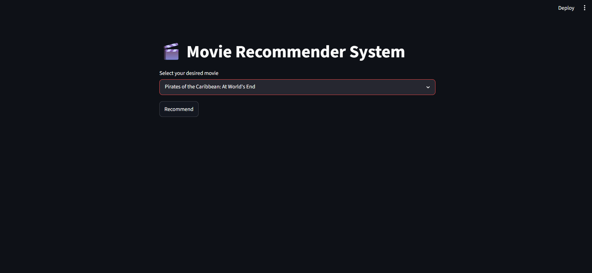
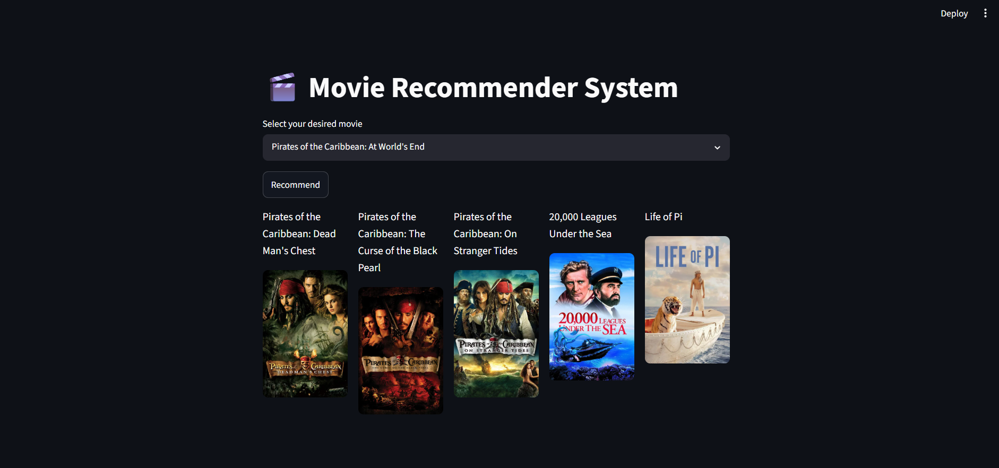
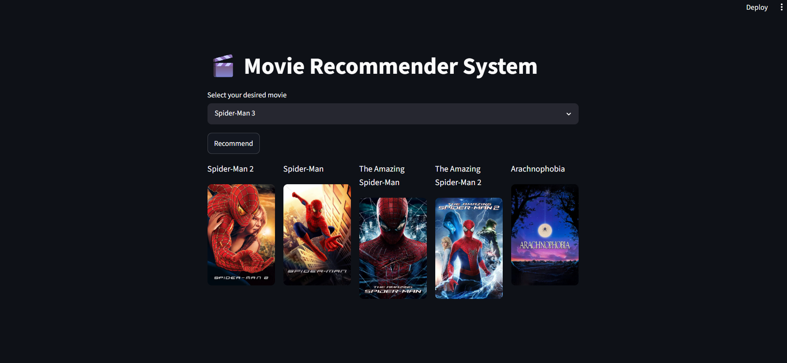

# 🎬 Movie Recommender System

A Movie Recommender System built using Python, Stream lit, and Machine Learning.

## Features

* Recommends 5 similar movies based on content similarity
* Displays movie posters using the TMDB API
* Interactive Stream lit web interface
* Content-based recommendation system

## Project Workflow

1. User selects a movie.
2. Content-based filtering finds similar movies.
3. Cosine similarity calculates recommendation scores.
4. Top 5 movies are selected.
5. TMDB API fetches movie posters.
6. Recommendations are displayed using Stream lit.

## Tech Stack

* Python
* Stream lit
* Pandas
* Scikit-Learn
* Numpy
* TMDb API

## Screenshots

### Home Page



### Recommendations Example 1



### Recommendations Example 2



## Repository Structure

app.py                 # Streamlit application
movie_dict.pkl         # Movie metadata
movie recommender system.ipynb  # Model building notebook
requirements.txt       # Dependencies

## How to Run

Install the required libraries:

```bash
pip install -r requirements.txt
```

Run the application:

```bash
streamlit run app.py
```

## Dataset

* TMDB 5000 Movies Dataset
* Content-Based Filtering
* Cosine Similarity

## Author

Ananya Saxena
